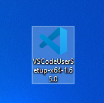
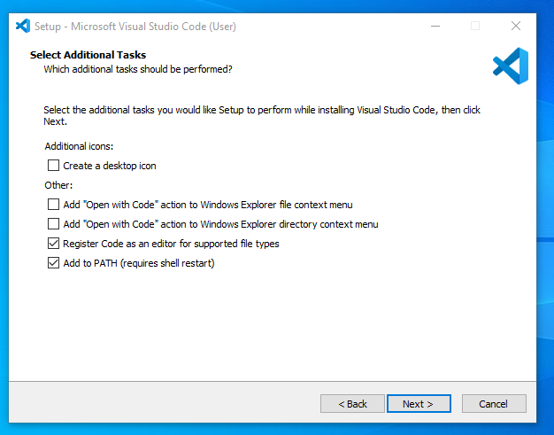

[](https://classroom.github.com/a/XoLGRbHq)
[](https://classroom.github.com/online_ide?assignment_repo_id=15271627&assignment_repo_type=AssignmentRepo)
# SE-Assignment-5
Installation and Navigation of Visual Studio Code (VS Code)
 Instructions:
Answer the following questions based on your understanding of the installation and navigation of Visual Studio Code (VS Code). Provide detailed explanations and examples where appropriate.

 Questions:

1. Installation of VS Code:
   - Describe the steps to download and install Visual Studio Code on Windows 11 operating system. Include any prerequisites that might be needed.


The following are some of the prerequisites needed to install VS Code:

   1.Windows 11 Operating System: Ensure you have Windows 11 installed on your computer.
   2.Administrative Rights: You may need administrative privileges to install software on your computer.
   

   Steps to install VS code on windows 11
Step 1: Visit the Official Website of the Visual Studio Code using any web browser like Google Chrome, Microsoft Edge, etc. ![alt text] ()
Step 2: Press the “Download for Windows” button on the website to start the download of the Visual Studio Code Application. ![alt text] ()
Step 3: When the download finishes, then the Visual Studio Code Icon appears in the downloads folder. ![alt text] ()
Step 4: Click on the Installer icon to start the installation process of the Visual Studio Code. 
Step 5: After the Installer opens, it will ask you to accept the terms and conditions of the Visual Studio Code. Click on I accept the agreement and then click the Next button. ![alt text] ()
Step 6: Choose the location data for running the Visual Studio Code. It will then ask you to browse the location.By default, VS Code is installed under C:\Users\{Username}\AppData\Local\Programs\Microsoft VS Code. Use the default location. Then click on the Next button. 
Step 7: Then it will ask to begin the installation setup. Click on the Install button. 
Step 8: After clicking on Install, it should take about 1 minute to install the Visual Studio Code on your device. 
Step 9: After the Installation setup for Visual Studio Code is finished, it will show a window like this below. Tick the “Launch Visual Studio Code” checkbox and then click Next. 
Step 10: After the previous step, the Visual Studio Code window opens successfully. Now you can create a new file in the Visual Studio Code window and choose a language of yours to begin your programming journey! 


2. First-time Setup:
   - After installing VS Code, what initial configurations and settings should be adjusted for an optimal coding environment? Mention any important settings or extensions.
The following configurations and settings allow seamless coding in vs code:
Essential Settings:

1.Interface Theme: VS Code offers a variety of themes for customizing the editor's look and feel. Choose a theme that's easy on your eyes and promotes focus. You can find them in the Settings section (search for "Theme"). Popular options include Dark+ (default dark theme) or One Dark Pro.

-Font Size and Line Height: Adjust the font size and line height for better readability. This is especially important for long coding sessions. You can find these settings under "Font Size" and "Line Height" in the Settings section.

-Keyboard Shortcuts: VS Code offers a rich set of keyboard shortcuts that can significantly improve your coding efficiency. There are built-in shortcuts and you can also install extensions that provide shortcuts specific to your programming language. Explore the built-in shortcuts (search for "Keyboard Shortcuts") and consider installing language-specific extensions later.

Recommended Extensions:

2.Language-specific extensions: VS Code provides excellent support for various programming languages. Install the extension for your primary language to gain features like syntax highlighting, IntelliSense (code completion), and debugging. Search for extensions within VS Code by opening the Extensions tab (Ctrl+Shift+X). The language extensions installed for this class is Python. 

3.Git Integration: If you plan on using Git for version control, install the built-in Git extension. This enables features like Git commands within VS Code, viewing version history, and staging changes.

4.Pylance: Fast, feature-rich language support for Python.


3. User Interface Overview:
   - Explain the main components of the VS Code user interface. Identify and describe the purpose of the Activity Bar, Side Bar, Editor Group, and Status Bar.

Activity Bar (Leftmost Bar): This vertical bar acts as the command center for VS Code. It provides quick access to different functionalities through a series of icons:

a. Views: These represent core functionalities like the File Explorer (for managing project files), Search (to find text within your codebase), Source Control (for version control using Git), and Debugger (for debugging your code).

b. Extensions: This section lets you discover, install, and manage extensions that add new features to VS Code.

c. Custom Views: Extensions can contribute their own views to the Activity Bar, providing additional functionalities specific to the extension.


Side Bar (Right Side): This collapsible panel offers contextual information based on the current view or selection:

a. Explorer View: When the Explorer view is active in the Activity Bar, the Side Bar displays the contents of the chosen folder, including files and subfolders.

b. Search Results: During a search, the Side Bar showcases matching files and their locations within your project.

d. Source Control Details: If you're using Git, the Side Bar provides details about specific commits or branches when the Git view is active.

e. Output Panel: When you run code, the Side Bar displays the output in the terminal.

Editor Group (Center Area): This is the core workspace where you write and edit your code. It can hold multiple editor windows organized in tabs, allowing you to work on different files simultaneously. Each editor provides features like syntax highlighting for better code readability, code completion suggestions to write code faster, and other functionalities specific to the programming language you're using.

Status Bar (Bottom Bar): This horizontal bar displays various informative elements:

a. File Information: The name of the currently opened file, along with your cursor's position (line and column number) within that file.
b. Indentation: The current indentation mode being used (spaces or tabs).
c. Git Status: (If Git is enabled) Shows the status of your project's files (modified, staged, etc.).
d. Encoding: The character encoding used by the current file.
e. Other Indicators: Depending on the context, the Status Bar might display additional information like warnings or ongoing tasks.

4. Command Palette:
   - What is the Command Palette in VS Code, and how can it be accessed? Provide examples of common tasks that can be performed using the Command Palette.
The Command Palette in Visual Studio Code (VS Code) is a powerful feature that allows you to access and execute a wide range of commands without leaving the keyboard. It provides a quick way to perform tasks, run commands, and navigate your workspace.

You can access the Command Palette in two main ways:

1.Keyboard Shortcut:
   -Press `Ctrl+Shift+P` (Windows/Linux) or `Cmd+Shift+P` (Mac).

2.Menu Navigation:
   -Go to the menu bar and select View > Command Palette.

 Common Tasks Performed Using the Command Palette

Here are some examples of common tasks you can perform using the Command Palette:

1.Changing the Color Theme

To change the color theme of your editor:
   1.Open the Command Palette (`Ctrl+Shift+P` or `Cmd+Shift+P`).
   2.Type `theme` to filter theme-related commands.
   3.Select `Preferences: Color Theme`.
   4.Choose from the list of available themes.

2.Installing Extensions

To install a new extension:
   1.Open the Command Palette.
   2.Type `ext install` to filter extension-related commands.
   3.Select `Extensions: Install Extensions`.
   4.Search for the desired extension and install it.

 3.Opening Files and Folders

To open a file or folder:
   1.Open the Command Palette.
   2.Type `open file` or `open folder`.
   3.Select `File: Open File...` or `File: Open Folder...`.
   4.Browse and select the file or folder you want to open.

 4.Running Tasks

To run a defined task:
   1.Open the Command Palette.
   2.Type `task` to filter task-related commands.
   3.Select `Tasks: Run Task`.
   4.Choose the task you want to run from the list.

5.Git Commands

To perform Git operations:
   1.Open the Command Palette.
   2.Type `git` to filter Git-related commands.
   3.Select from various Git commands, such as `Git: Commit`, `Git: Pull`, or `Git: Push`.

6.Opening Settings

To open and modify settings:
   1.Open the Command Palette.
   2.Type `settings`.
   3.Select `Preferences: Open Settings (UI)` for the graphical settings editor or `Preferences: Open Settings (JSON)` for the JSON settings file.

7.Format Document

To format the entire document:
   1.Open the Command Palette.
   2.Type `format`.
   3.Select `Format Document`.

8.Quickly Navigating to Symbols. 

To navigate to a specific symbol (function, variable, etc.) in your code:
   1.Open the Command Palette.
   2.Type `@` followed by the symbol name to search within the current file.
   3.Select the desired symbol to jump to its location.

9.Toggling Sidebar and Panels

To toggle the visibility of the sidebar or panels:
   1.Open the Command Palette.
   2.Type `view` to filter view-related commands.
   3.Select `View: Toggle Sidebar Visibility` or `View: Toggle Panel`.

10.Launching Debug Configurations

To start a debug session:
   1.Open the Command Palette.
   2.Type `debug`.
   3.Select `Debug: Start Debugging` or choose a specific configuration.

Example of Using the Command Palette

If you want to format the current document, follow these steps:

   1.Open the Command Palette (`Ctrl+Shift+P` or `Cmd+Shift+P`).
   2.Type `format document`.
   3.Select `Format Document` from the list.
   4.VS Code will format the document according to your configured formatter (e.g., Prettier).

Summary

The Command Palette in VS Code is an essential tool that streamlines your workflow by allowing you to quickly access and execute a variety of commands. By learning to use the Command Palette effectively, you can enhance your productivity and navigate your development environment with ease.

5. Extensions in VS Code:
   - Discuss the role of extensions in VS Code. How can users find, install, and manage extensions? Provide examples of essential extensions for web development.

Visual Studio Code (VS Code) is a powerful code editor, but extensions take it to the next level. Extensions are essentially add-ons that contribute new features and functionalities to VS Code, allowing you to customize your development environment to fit your specific needs and preferences.

Finding and Installing Extensions:

1.VS Code Extension Marketplace: The built-in VS Code Extension Marketplace provides a vast library of extensions. Open it by navigating to the Extensions tab (Ctrl+Shift+X) on the left sidebar.

2.Search and Explore:  Search for extensions by keyword or browse through categories like programming languages, themes, debuggers, and more.

3.Install and Manage: Click the "Install" button for an extension you find useful. Once installed, you can manage them from the Extensions tab. You can enable/disable them, configure settings, or even uninstall them if needed.

Essential Extensions for Web Development:

Here are some popular and essential extensions for web development in VS Code:

*Language-specific extensions: These extensions provide syntax highlighting, code completion, debugging, and other language-specific features. Popular options include:

    *HTML, CSS, and JavaScript (built-in): VS Code offers excellent built-in support for these core web development languages.
    *ESLint:Identifies and fixes potential errors and stylistic issues in your JavaScript code.
    *Prettier:Formats your code automatically according to a consistent style guide.

*Live Server: Launches a local development server within VS Code, allowing you to preview your web pages in a browser with automatic code reloading as you make changes.

*GitLens: Supercharges your Git workflow by providing a visual representation of your Git repository, making it easier to navigate commits, branches, and code changes.

*Debugger for Chrome/Firefox: Enables debugging of your web applications directly within VS Code, allowing you to set breakpoints, inspect variables, and step through your code line by line.

*Remote Development: Enables development on a remote server or container directly from VS Code, streamlining your workflow for cloud-based projects.


6. Integrated Terminal:
   - Describe how to open and use the integrated terminal in VS Code. What are the advantages of using the integrated terminal compared to an external terminal?

VS Code offers a convenient integrated terminal, eliminating the need to switch back and forth between separate terminal windows. Here's how to access and leverage it:

Opening the Integrated Terminal:

There are three ways to open the integrated terminal:

1.Menu Bar: Navigate to the menu bar and select **Terminal > New Terminal.
2.Keyboard Shortcut: Use the keyboard shortcut:
    *Windows/Linux: Ctrl+` (backtick key)
    *Mac: Cmd+` (backtick key)
3.Activity Bar: Open the Activity Bar (leftmost bar) and click on the terminal icon (looks like a command prompt).

Using the Integrated Terminal:

Once opened, the terminal functions similarly to any external terminal application. You can type your commands and see the corresponding output. The integrated terminal supports various features:

*Command Execution: Run commands like `git status`, `npm install`, or any other command-line tool you need for your project.
*Multiple Terminals: You can open split panes within the terminal to work with multiple command prompts simultaneously. 
*Customization: Right-click inside the terminal and navigate to the settings menu to configure the terminal appearance, font size, and other preferences.

Advantages of the Integrated Terminal:

*Convenience:  Seamlessly switch between editing code and running commands without leaving VS Code. This streamlines your workflow and reduces context switching.
*Integrated Shell Integration: VS Code's terminal integrates with the shell you're using (e.g., Bash, PowerShell). This provides features like working directory tracking (indicated by a left-hand side decoration) and clickable links within the terminal output (e.g., for opening files mentioned in error messages).
*Project Context: The terminal automatically opens in the directory of your current VS Code workspace, eliminating the need to navigate there manually.

While external terminals offer more flexibility for advanced users, VS Code's integrated terminal provides a convenient and efficient solution for most development tasks, keeping your coding environment organized and focused. 

7. File and Folder Management:
   - Explain how to create, open, and manage files and folders in VS Code. How can users navigate between different files and directories efficiently?

Visual Studio Code (VS Code) provides several intuitive ways to create, open, and manage files and folders, facilitating an efficient and organized workflow.

 Creating Files and Folders

1.Using the Explorer View:
   -Create a New File:
     -Open the Explorer view by clicking the file icon in the sidebar or pressing `Ctrl+Shift+E`.
     -Right-click within the folder where you want to create a new file and select 'New File'.
     -Alternatively, you can click the `New File` icon (a blank page with a plus sign) at the top of the Explorer.
     -Enter the file name and press `Enter`.
   -Create a New Folder:
     -Right-click within the folder where you want to create a new folder and select 'New Folder'.
     -Enter the folder name and press `Enter`.

2.Using the Command Palette:
   -Press `Ctrl+Shift+P` (Windows/Linux) or `Cmd+Shift+P` (Mac) to open the Command Palette.
   -Type `File: New File` to create a new file or `Explorer: New Folder` to create a new folder.

3.Using Keyboard Shortcuts:
   -New File: Press `Ctrl+N` (Windows/Linux) or `Cmd+N` (Mac) to create a new file.

 Opening Files and Folders

1.Open a File:
   -File Explorer:
     - Click the file icon in the sidebar or press `Ctrl+Shift+E`.
     - Navigate to the desired file and click to open it.
   -Quick Open:
     - Press `Ctrl+P` (Windows/Linux) or `Cmd+P` (Mac).
     - Start typing the file name. As you type, VS Code provides a list of matching files.
     - Select the desired file from the list and press `Enter`.
   -Command Palette:
     -Open the Command Palette (`Ctrl+Shift+P` or `Cmd+Shift+P`).
     -Type `File: Open File`, then navigate to and select the file.

2.Open a Folder:
   -Menu Bar:
     - Navigate to 'File' > 'Open Folder'.
     - Browse to the desired folder and click 'Select Folder' (Windows/Linux) or 'Open' (Mac).
   -Command Palette:
     -Open the Command Palette (`Ctrl+Shift+P` or `Cmd+Shift+P`).
     -Type `File: Open Folder`, then navigate to and select the folder.

3.Open Recent Files/Folders:
   -Menu Bar:
     -Navigate to 'File' > 'Open Recent'.
   -Quick Open:
     -Press `Ctrl+P` (Windows/Linux) or `Cmd+P` (Mac).
     -Type `>recent` and select from the list of recently opened files and folders.

Managing Files and Folders

1.Rename:
   -Right-click the file or folder in the Explorer view and select 'Rename'.
   -Enter the new name and press `Enter`.

2.Delete:
   -Right-click the file or folder in the Explorer view and select 'Delete'.
   -Confirm the deletion when prompted.

3.Move:
   -Drag and drop the file or folder within the Explorer view to the desired location.

4.Copy and Paste:
   -Right-click the file or folder and select 'Copy'.
   -Right-click the target location and select 'Paste'.

 Navigating Between Files and Directories Efficiently

1.Quick Open:
   -Press `Ctrl+P` (Windows/Linux) or `Cmd+P` (Mac) to open the Quick Open dialog.
   -Type the name of the file you want to open. As you type, VS Code filters and displays matching files.
   -Select the desired file and press `Enter`.

2.Go to Symbol:
   -Press `Ctrl+Shift+O` (Windows/Linux) or `Cmd+Shift+O` (Mac) to open the Go to Symbol dialog.
   -Type the name of the symbol (e.g., function, variable) you want to navigate to.
   -Select the desired symbol and press `Enter`.

3.Go to Definition:
   -Place the cursor over a symbol (e.g., function, variable) and press `F12` or right-click and select 'Go to Definition'.
   -This will navigate to the location where the symbol is defined.

4.Peek Definition:
   -Place the cursor over a symbol and press `Alt+F12` (Windows/Linux) or `Option+F12` (Mac).
   -This will display a small preview of the definition inline without navigating away from the current file.

5.File Explorer:
   -Use the file explorer in the sidebar to navigate between files and folders by clicking on them.

6.Breadcrumbs:
   -Enable breadcrumbs to show the current location and allow quick navigation.
   -Go to View > Appearance > Show Breadcrumbs or press `Ctrl+Shift+.` (Windows/Linux) or `Cmd+Shift+.` (Mac).

7.Keyboard Shortcuts for Navigation:
   -Switch Between Open Editors: Press `Ctrl+Tab` (Windows/Linux/Mac) to cycle through open editors.
   -Navigate Back and Forward: Use `Alt+Left Arrow` and `Alt+Right Arrow` (Windows/Linux) or `Ctrl+-` and `Ctrl+Shift+-` (Mac) to navigate back and forward in your edit history.


8. Settings and Preferences:
   - Where can users find and customize settings in VS Code? Provide examples of how to change the theme, font size, and keybindings.

Visual Studio Code (VS Code) offers extensive customization options to tailor the editor to your preferences. You can access and modify settings through the user interface or by directly editing the settings JSON file.

Accessing Settings

1.Using the Menu Bar**:
   -Navigate to File > Preferences > Settings** (Windows/Linux).
   -Navigate to Code > Preferences > Settings (Mac).

2.Using Keyboard Shortcuts:
   -Press `Ctrl+,` (Windows/Linux) or `Cmd+,` (Mac).

3.Using the Command Palette:
   -Open the Command Palette by pressing `Ctrl+Shift+P` (Windows/Linux) or `Cmd+Shift+P` (Mac).
   -Type `Preferences: Open Settings` and select it.

Customizing Settings

Settings in VS Code are organized into two categories:
-User Settings: Settings that apply globally to any instance of VS Code you open.
-Workspace Settings: Settings that apply to the specific workspace or project you have open.

Changing the Theme

1.Using the Settings UI:
   -Open the Settings UI as described above.
   -In the search bar, type `color theme`.
   -Select the desired theme from the dropdown menu under Workbench: Color Theme.

2.Using the Command Palette:
   -Open the Command Palette (`Ctrl+Shift+P` or `Cmd+Shift+P`).
   -Type `Color Theme` and select `Preferences: Color Theme`.
   -Browse through the list and click on the theme you want to apply.

 Changing the Font Size

1.Using the Settings UI:
   -Open the Settings UI.
   -In the search bar, type `font size`.
   -Adjust the value for Editor: Font Size.

2.Using the settings.json File:
   -Open the Settings UI.
   -Click the `{}` icon in the top right corner to open the `settings.json` file.
   -Add or modify the following setting:
     ```json
     "editor.fontSize": 14
     ```
   -Change the value to your desired font size.

Customizing Keybindings

1.Using the Menu Bar:
   -Navigate to File > Preferences > Keyboard Shortcuts (Windows/Linux).
   -Navigate to Code > Preferences > Keyboard Shortcuts (Mac).

2.Using Keyboard Shortcuts:
   -Press `Ctrl+K, Ctrl+S` (Windows/Linux) or `Cmd+K, Cmd+S` (Mac).

3.Modifying Keybindings:
   -In the Keyboard Shortcuts editor, you can search for commands and modify their keybindings by clicking on the pencil icon next to the command and pressing the new key combination.
   -Alternatively, you can edit the keybindings JSON file directly by clicking the `{}` icon in the top right corner:
     ```json
     [
       {
         "key": "ctrl+alt+n",
         "command": "workbench.action.files.newUntitledFile"
       },
       {
         "key": "ctrl+alt+b",
         "command": "workbench.action.terminal.toggleTerminal"
       }
     ]
     ```
   -This example sets `Ctrl+Alt+N` to create a new untitled file and `Ctrl+Alt+B` to toggle the integrated terminal.

 Example Customizations

Changing the Theme to a Dark Theme

   1.Open the Command Palette (`Ctrl+Shift+P` or `Cmd+Shift+P`).
   2.Type `Color Theme` and select `Preferences: Color Theme`.
   3.Choose a dark theme, such as 'Dark+ (default dark)'.

Setting the Font Size to 16

   1.Open the Settings UI (`Ctrl+,` or `Cmd+,`).
   2.In the search bar, type `font size`.
   3.Change the Editor: Font Size to `16`.

Custom Keybinding for Saving All Files

   1.Open the Keyboard Shortcuts editor (`Ctrl+K, Ctrl+S` or via the menu).
   2.Search for `Save All`.
   3.Click the pencil icon next to `File: Save All`.
   4.Press the desired key combination, e.g., `Ctrl+Shift+S`.
   5.Confirm the new keybinding.

 Summary

VS Code provides a flexible and powerful settings system that can be accessed through the Settings UI, Command Palette, or directly via the `settings.json` and `keybindings.json` files. You can easily customize your development environment by changing the theme, adjusting the font size, and setting up custom keybindings. These customizations help create a personalized and efficient coding environment tailored to your preferences.

9. Debugging in VS Code:
   - Outline the steps to set up and start debugging a simple program in VS Code. What are some key debugging features available in VS Code?

VS Code offers a comprehensive debugging environment with features like breakpoints, call stacks, and an integrated console. Here’s how you can set up and start debugging a simple program, such as a basic Python application.

 Steps to Set Up and Start Debugging

 Step 1: Install Necessary Extensions

1.For Python:
   -Install the Python extension by Microsoft.
     -Open the Extensions view by clicking the Extensions icon in the Sidebar or pressing `Ctrl+Shift+X`.
     -Search for "Python" and install the extension by Microsoft.


Step 2: Create a Simple Program

1.Python Example:
   - Create a new Python file (`example.py`) with the following content:
     ```python
     def greet(name):
         print(f"Hello, {name}!")

     if __name__ == "__main__":
         user_name = "World"
         greet(user_name)
     ```

 Step 3: Open the Debug Panel

1.Click on the Debug icon in the Sidebar or press `Ctrl+Shift+D` to open the Debug panel.

Step 4: Configure the Debugger

1.Python:
   - Click on the gear icon in the Debug panel to open the `launch.json` file.
   - VS Code might prompt you to select an environment. Choose "Python File".
   - A `launch.json` file will be created with a default configuration like this:
     ```json
     {
         "version": "0.2.0",
         "configurations": [
             {
                 "name": "Python: Current File",
                 "type": "python",
                 "request": "launch",
                 "program": "${file}",
                 "console": "integratedTerminal"
             }
         ]
     }
     ```


 Step 5: Set Breakpoints

   1.Open the file you want to debug (`example.py` or `example.js`).
   2.Click in the gutter (left margin) next to the line numbers where you want to set a breakpoint. A red dot will appear indicating the breakpoint.

 Step 6: Start Debugging

   1.Go back to the Debug panel.
   2.Select the configuration you created (e.g., "Python: Current File" or "Launch Program").
   3.Click the green play button or press `F5` to start debugging.

 Key Debugging Features in VS Code

1.Breakpoints:
   -Set breakpoints by clicking in the gutter next to the line numbers.
   -Conditional breakpoints can be set by right-clicking the breakpoint and adding conditions.

2.Watch:
   -Add expressions to the Watch panel to monitor their values as you step through your code.

3.Call Stack:
   -View the call stack to see the sequence of function calls that led to the current point in the program.

4.Variables:
   -Inspect the current values of variables in the Variables panel.

5.Integrated Console:
   -Execute commands and interact with the program while it’s running in the integrated terminal.

6.Step Controls:
   -Continue (`F5`): Resume program execution until the next breakpoint.
   -Step Over (`F10`): Execute the next line of code, stepping over function calls.
   -Step Into (`F11`): Step into the next function call.
   -Step Out (`Shift+F11`): Step out of the current function.
   -Restart (`Ctrl+Shift+F5`): Restart the debugging session.
   -Stop (`Shift+F5`): Stop the debugging session.

7.Debug Console:
   -Evaluate expressions and execute commands in the context of the debug session.

Summary

VS Code's debugging capabilities provide a robust environment for testing and troubleshooting code. By following the steps to set up and start debugging, you can efficiently locate and fix issues in your code. Key features like breakpoints, the call stack, and variable inspection enhance your ability to understand and control program execution. These tools and functionalities make VS Code a powerful editor for development and debugging.

10. Using Source Control:
    - How can users integrate Git with VS Code for version control? Describe the process of initializing a repository, making commits, and pushing changes to GitHub.

Integrating Git with VS Code for Version Control

VS Code provides built-in Git support, making it easy to perform version control tasks directly from the editor. Here’s how you can integrate Git with VS Code, including initializing a repository, making commits, and pushing changes to GitHub.

Step 1: Initializing a Git Repository

1.Open your project in VS Code:
   -Open VS Code and open the folder containing your project by navigating to 'File' > 'Open Folder' or using the shortcut `Ctrl+K, Ctrl+O` (Windows/Linux) or `Cmd+K, Cmd+O` (Mac).

2.Initialize the Git Repository:
   -Open the Source Control panel by clicking the Source Control icon in the Sidebar or pressing `Ctrl+Shift+G`.
   -Click the `Initialize Repository` button. This will create a `.git` directory in your project folder, initializing it as a Git repository.

Step 2: Making Changes and Committing

1.Make Changes to Your Files:
   -Edit your files as needed. Changes will be tracked by Git.

2.View Changes:
   -Open the Source Control panel (`Ctrl+Shift+G`).
   -You’ll see a list of files with changes under 'Changes'.

3.Stage Changes:
   -Hover over the file you want to stage and click the `+` icon that appears to stage individual files.
   -Alternatively, click the `+` icon next to Changes to stage all modified files.

4.Commit Changes:
   -After staging the changes, you’ll see them under 'Staged Changes'.
   -Enter a commit message in the input box at the top of the Source Control panel.
   -Click the checkmark icon to commit the staged changes.

Step 3: Pushing Changes to GitHub

1.Add a Remote Repository:
   -If you don’t have a remote repository yet, create one on GitHub:
     -Go to GitHub and create a new repository.
     -Copy the repository URL (e.g., `https://github.com/yourusername/your-repository.git`).
   -In VS Code, open the integrated terminal (`Ctrl+` or `Cmd+`).
   -Add the remote repository using the following command:

     git remote add origin https://github.com/yourusername/your-repository.git
     

2.Push Changes to GitHub:
   -Open the Source Control panel (`Ctrl+Shift+G`).
   -Click the `...` icon for more actions and select 'Push'.
   -Alternatively, you can push from the terminal:
     
     git push -u origin master
     
   -If prompted, enter your GitHub credentials or set up SSH keys for authentication.

Additional Git Features in VS Code

1.Branch Management:
   -Create, switch, and manage branches using the Git branch dropdown in the Status Bar.
   -Click on the current branch name in the Status Bar to view branch options.
   
2.Merge and Rebase:
   -Perform merge and rebase operations through the Command Palette (`Ctrl+Shift+P` or `Cmd+Shift+P`) by typing and selecting the appropriate Git command.

3.View Commit History:
   -View the commit history by navigating to View > SCM > Show Git Graph or using extensions like "GitLens".

4.Resolve Conflicts:
   -When conflicts arise, VS Code highlights the conflicts in the editor, and you can use the inline merge conflict editor to resolve them.


 Submission Guidelines:
- Your answers should be well-structured, concise, and to the point.
- Provide screenshots or step-by-step instructions where applicable.
- Cite any references or sources you use in your answers.
- Submit your completed assignment by 1st July 

